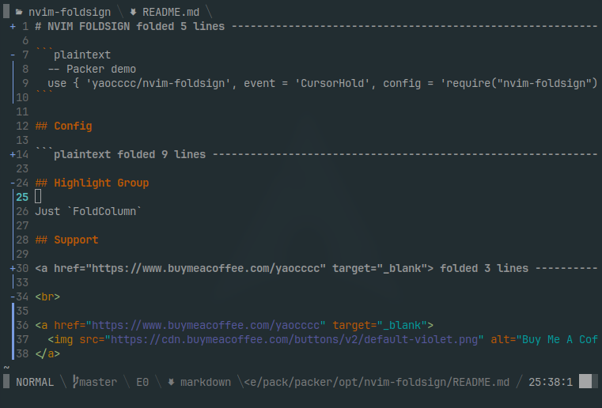

# NVIM FOLDSIGN

Display folding info on sign column



## Usage

```plaintext
  -- Packer demo
  use { 'yaocccc/nvim-foldsign', event = 'CursorHold', config = 'require("nvim-foldsign").setup()' }
```

## Config

```lua
    require('nvim-foldsign').setup({
        offset = -2,
        foldsigns = {
            open = '-',          -- mark the beginning of a fold
            close = '+',         -- show a closed fold
            seps = { '│', '┃' }, -- open fold middle marker
        },
        enabled = true,
    })
```

## Toggling Foldsign

```vim
:lua require('nvim-foldsign').toggle_foldsign()
```

OR setting custom keymap

```lua
vim.keymap.set('n', '<leader>tf', require('nvim-foldsign').toggle_foldsign )
```

## Highlight Group

Just `FoldColumn`

## Support

<a href="https://www.buymeacoffee.com/yaocccc" target="_blank">
  
</a>

<br>

<a href="https://www.buymeacoffee.com/yaocccc" target="_blank">
  
</a>
